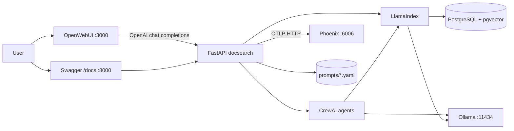
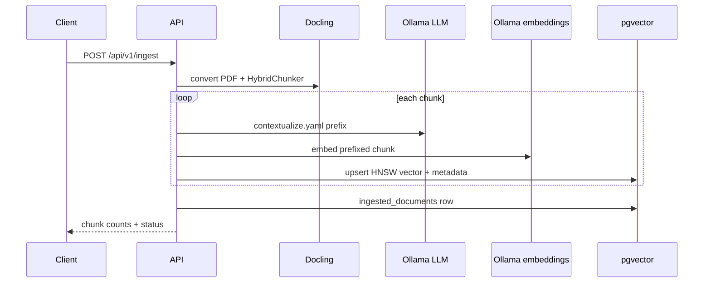
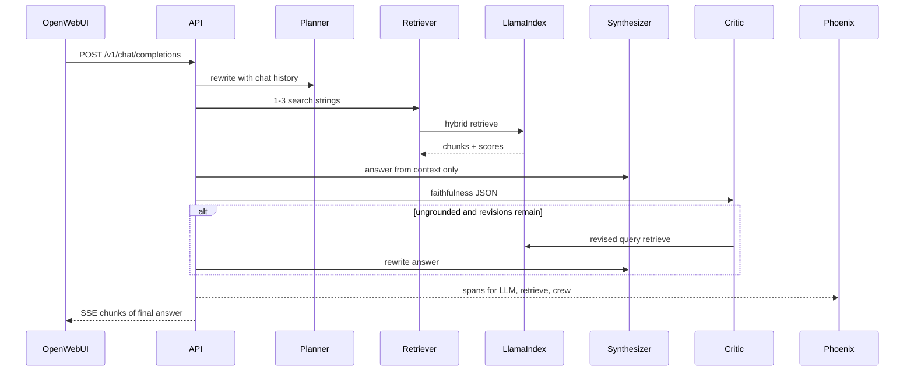

# Solution architecture

Companion to the [README](../README.md). This document is the design record for the Document Search Platform.

## 1. Context

The assessment asks for a document search backend that OpenWebUI can call as a chat model. Knowledge lives in PDFs. Retrieval must be **agentic RAG**, not a single embed-and-prompt hop. Every inference call must be **traced**. Prompts must live **outside application code**. Quality must be **measured**.

Mandatory components and where they sit:

| Requirement | Choice in this repo |
|-------------|---------------------|
| Document preprocessing | Docling `DocumentConverter` + `HybridChunker` |
| Vector database | PostgreSQL 16 + pgvector (HNSW, cosine) |
| RAG framework | LlamaIndex (`PGVectorStore`, hybrid retriever) |
| Multi-agent | CrewAI sequential crew (planner, retriever, synthesizer, critic) |
| LLM provider | Ollama (`llama3.2` + `nomic-embed-text`) |
| PromptOps + tracing | YAML prompt library + Arize Phoenix / OpenInference |
| Evaluation | RAGAs on `data/eval/golden_set.json` |
| Frontend | OpenWebUI via OpenAI-compatible `/v1` |

## 2. Container and process view

Docker Compose owns Postgres, Phoenix, and OpenWebUI. The API and (by default) Ollama run on the host so model files and Python virtualenv stay local. An optional `ollama` Compose profile exists for machines without a native install.

## 3. Ingestion sequence

Contextual prefixes follow Anthropic-style **contextual retrieval**: a short sentence situates the chunk in its source document before embedding. Disable with `ENABLE_CONTEXTUAL_ENRICHMENT=false`.

## 4. Agentic retrieval sequence

CrewAI is the mandated multi-agent layer. The same four roles also run as explicit LLM steps so a small local model still produces an answer if tool-calling inside CrewAI fails.

## 5. Data model

**`ingested_documents`** — operational catalog (filename, path, chunk_count, status, error).

**`data_document_chunks`** (LlamaIndex `PGVectorStore`, table name from `VECTOR_TABLE`) — embedding column `vector(768)`, text, metadata JSON (`filename`, `page`, `chunk_index`, `context_prefix`). Hybrid search adds a `tsvector` column when `ENABLE_HYBRID_SEARCH=true`.

## 6. PromptOps

Prompts are versioned YAML files:

- `query_planner.yaml`
- `retriever.yaml`
- `synthesizer.yaml`
- `critic.yaml`
- `contextualize.yaml`
- `direct_rag.yaml`

`PromptStore` loads them from `PROMPTS_DIR`. With `PROMPT_HOT_RELOAD=true`, mtime changes are picked up on the next render. Phoenix traces capture the rendered prompt text on each inference span so prompt diffs can be compared in the UI.

## 7. Observability

On API startup, `phoenix.otel.register` exports OTLP HTTP traces to `PHOENIX_COLLECTOR_ENDPOINT`. OpenInference instrumentors wrap LlamaIndex, OpenAI-compatible clients, and CrewAI. If Phoenix is down, the API logs a warning and continues.

Useful Phoenix views after a query:

- Trace waterfall per user question
- Span attributes: retrieved document names, model, latency
- Project name: `document-search-platform`

## 8. Evaluation

`POST /api/v1/evaluate` and `scripts/evaluate.py`:

1. Load golden pairs  
2. Run agentic RAG  
3. Compute lexical hit-rate and latency p50/p95  
4. Run RAGAs with Ollama wrapped as a LangChain OpenAI-compatible judge  

This satisfies “evaluate accuracy and performance” without a paid cloud judge.

## 9. OpenWebUI contract

OpenWebUI is treated as an OpenAI client:

- `GET /v1/models` → `docsearch-agentic`, `docsearch-direct`
- `POST /v1/chat/completions` with `stream: true|false`

No OpenWebUI plugin/pipe is required. Compose sets `OPENAI_API_BASE_URL` and disables the built-in Ollama connection so users only see this backend.

## 10. Failure modes and mitigations

| Failure | Mitigation |
|---------|------------|
| Ollama down | `/health` degraded; query returns 500 with a clear error |
| Postgres down | `/health` error; ingest refuses |
| CrewAI tool-calling weak on 3B models | Sequential fallback using the same YAML prompts |
| Embedding dim mismatch | Documented reset of the pgvector table |
| Phoenix down | Tracing skipped; product path unaffected |
| Empty knowledge base | Synthesizer instructed to admit insufficient context |

## 11. Why these boundaries

- **FastAPI** is the only process OpenWebUI talks to, which keeps auth, tracing, and prompt loading in one place.
- **LlamaIndex** owns chunk nodes and the vector store so we do not re-implement ANN search.
- **CrewAI** owns roles and task graph; retrieval itself stays a deterministic LlamaIndex tool.
- **Docling** is used at ingest time only, so query latency does not include layout analysis.
- **RAGAs** is out-of-band (explicit evaluate endpoint), not on the chat hot path.
